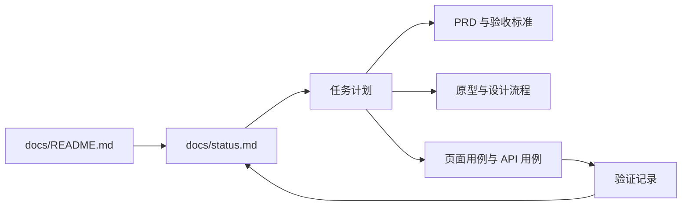

# 原型与交互入口

本任务没有新增前端页面，页面原型不适用。下图是开发者/Agent 的文档导航原型，
用于说明入口顺序，不代表已经实现某个网页。未来 UI 任务在此放可查看的页面原型，
图片、HTML 等资源放本任务的 assets 目录并使用相对链接。

```mermaid
flowchart LR
    A[docs/README.md] --> B[docs/status.md]
    B --> C[任务计划]
    C --> D[PRD 与验收标准]
    C --> E[原型与设计流程]
    C --> F[页面用例与 API 用例]
    F --> G[验证记录]
    G --> B
```

页面状态、输入控件、定位语义：不适用；本次交互入口为命令行与文档阅读。
