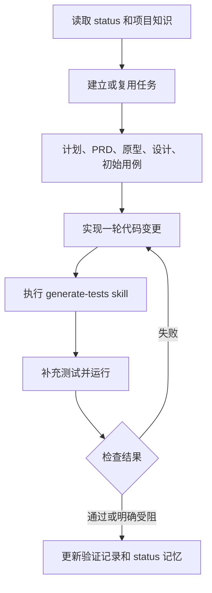

# 设计与流程

docs 保存业务文档和任务事实；.agents/project 保存简短入口引用、config.json。
框架提供 docs 和任务模板；只初始化缺失文档，升级不覆盖已存在内容。
status 表是任务状态的唯一来源，任务文件补充决策、验收细节与证据。

API 测试：Python runner 构建/启动 Go fixture，读取随机本机端口，通过 HTTP 发送请求；
fixture 使用真实路由/handler/业务用例，依赖内存用户存储，退出后释放进程与资源。
该测试覆盖 HTTP 到业务边界，不能替代数据库、完整部署或浏览器测试。

兼容性：不添加专有 skill frontmatter，也不通过保存文件的 hook 启动模型；
共享 AGENTS 工作流程要求 agent 在每轮代码修改后实际读取并执行 generate-tests。
