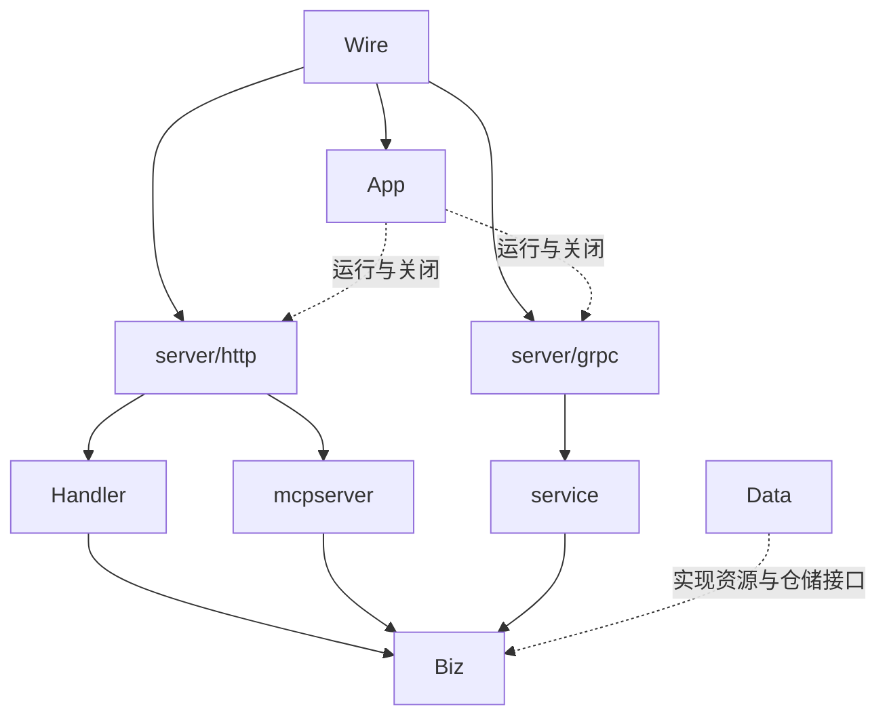

# 重构设计

以 [前轮分析](analysis.md) 为证据，以下为本轮实施决策。

- app 接收已构建服务，串行建立 listeners，任一失败关闭已建立 listener 与资源；Stop 同步等待完成并复用结果。
- lifecycle 收集具名关闭函数，逆序关闭；Wire provider 向同一 Lifecycle 注册 cleanup，bootstrap 在初始化失败时清理；App 成功后拥有该 Lifecycle。服务先关闭、DB 再关闭、日志最后关闭。
- server/http 保留 /api/v1 公开 auth 与 JWT/Casbin 保护组；MCP 仍独立挂载。server/grpc 保留 Proto 校验，增加 trace/取消/错误边界。
- config 独立 Viper：默认值 < includes（依声明顺序）< 入口文件 < APP 环境变量；目录入口现按配置收敛要求加载 test.yaml。不让新默认覆盖明确的零值关闭策略。资源相对路径默认保持项目工作目录语义。
- middleware 顺序 trace → access → recovery → error → timeout，再进入业务鉴权。timeout 只取消 context，响应由现有数值 code 错误边界决定；不后台执行 Gin handler。
- pkg/trace、pkg/logger、pkg/apperr 为公共能力。日志不记录请求体、query 或凭据，错误详情只在统一边界记录；stdout 与可选滚动文件，logger 无全局状态。
- 文档生成与资源接口已在后续删除批次移除；初版设计仅作为历史记录。
- biz/shared.TxScope 不感知 ORM；data/shared 管理事务 context，auth/dict repo 使用相同 helper。禁止不明确的嵌套事务，当前单仓储业务不强制增加事务。
- Makefile 的 build 仅编译；generate 显式生成；工具版本固定；clean 只清理构建产物。ENV/CONFIG_FILE 和旧 CONFIG_DIR 兼容。

## 配置入口收敛

test.yaml 吸收旧 config.yaml 中原本被 test 引用的设置，并保留 test 的 mode=test/log.level=warn。
line.yaml 仅引用公共基础配置，不包含测试凭据。config.DefaultPath 统一 CLI 与空路径默认值；
目录入口拼接 test.yaml，具体文件仍按原路径加载；Make 默认 ENV=test，并拒绝其他环境名称。
三个 CLI 与 Make 的选择规则一致。缺失 test.yaml 必须报错，不能自动切换到 line。

## 删除文档生成后的边界

App Lifecycle 仅管理日志和数据库。HTTPDeps 移除 DocumentHandler，Wire 移除所有文档构造函数。
HTTP 仅注册 auth/hello/dict 和独立 MCP，不添加旧接口兼容 shim；旧路径由普通 NoRoute 返回 404。
API 写期限统一使用 WriteTimeout，普通 API context 使用 RequestTimeout；MCP 继续排除这两种期限。
从 config 删除 DocumentConfig 与 DocumentTimeout，不为已删除能力保留配置入口或校验。
删除业务 templates 及文档 Proto；Proto/Wire 通过正式生成命令更新，其他公共框架模板目录继续用于任务流程。
