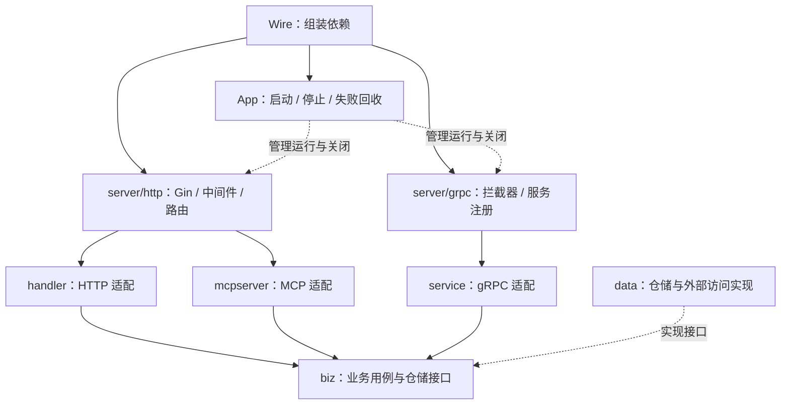

# goweb_brand_manage 与 auth_info：结构对比与融合建议

范围：比较当前工作区源码的结构与工程边界，不审计所有业务功能，不执行迁移。
核实日期：2026-09-30。auth_info 基线 `5cffad6`；参考项目 HEAD `76becec`，参考工作区存在用户未提交的配置改动与未跟踪的索引/规划文件，均未修改。
历史报告：以下“现状”指重构前基线；document 生成功能与源码已在后续批次删除，相关路径仅是历史证据；2026-10-01 已进入实施，当前结构以 [架构](../../architecture.md) 为准。引用移动后的路径用于继续导航，历史结论不要视为当前实现。测试范围见 [验证记录](05-verification.md)。
复核触发：任一项目的 server/app、配置、协议契约、事务或日志机制发生变化。

## 判断

适合做增量融合。两个项目都采用 Gin + Wire + Viper + Zap + GORM，已有 router → handler → biz → data 主干，主要依赖版本也相近。参考项目的价值集中在服务装配、生命周期、配置和请求可观测性；当前项目在 Proto 契约、多协议业务复用、认证授权和知识管理上有应保留的基础。

优先移植职责分离与可测试性；单纯统一文件夹名字的收益较小。无需将 auth_info 重写为参考项目的纯 REST 形态。

## 一、值得吸收的部分

| 方向 | 参考实现及优势 | auth_info 现状 | 融合判断 |
| --- | --- | --- | --- |
| 服务构建与应用运行分离 | `server.NewHTTPServer` 创建 Gin、挂载中间件/路由、设置 HTTP 超时；App 接收完整服务 | NewApp 同时构建 Gin、路由、gRPC，Run 再创建 HTTP server | 第一优先：增加 server/http.go 与 server/grpc.go，App 负责运行协调 |
| 生命周期集中管理 | LifecycleHook 命名资源，Stop 逆序关闭 MySQL、Redis、日志，并保证 hook 只执行一次 | Stop 关闭 HTTP/gRPC、Sync 日志，DB 未纳入 App 关闭流程 | 第一优先：纳入 DB，保留现有 gRPC 超时强停；补齐初始化中途失败的回收 |
| 配置实例隔离与环境入口 | 独立 Viper 实例；按序合并 includes，入口文件覆盖；支持明确文件路径、默认值 | 全局 Viper；固定 config.yaml；Server 只有 port/mode | 第二阶段：先支持文件与旧目录两种入口，再按需拆配置；增加校验 |
| TraceID 与结构化请求日志 | TraceID 写入 request context/响应头，访问/错误/panic 日志可关联，超时可配置 | gin.Logger/gin.Recovery 加错误中间件；缺少贯穿业务调用的 TraceID | 第二阶段：先引入 TraceID、元数据日志与取消传播；采用当前错误协议 |
| 跨仓储事务接口 | biz/shared.TxScope 定义事务范围；data/shared 实现 GORM 事务；repo 从 context 取事务 | auth/dict 仓储目前各自使用注入 DB，没有统一跨仓储事务入口 | 有真实跨仓储原子写入需求时引入，避免为简单 CRUD 增加空抽象 |
| 业务模型与协议转换分开 | brand 的 domain、writemodel、handler response、data model 分工清晰 | auth/dict 已有 biz model、repository、data model/converter；handler 使用 Proto | 延续已有分层；复杂写入可增加 biz Input/Command，不重复手写 Proto DTO |
| 基础设施测试与对照回归 | app/server/config/middleware/tx 有独立测试；API 支持旧新服务响应对照 | 已有 Go 包测试与隔离的 Python HTTP fixture，app/server 边界测试较少 | 借鉴测试场景和对照思路，保留现有测试 runner |

主要代码证据：

- 服务与生命周期：[参考 server](../../../../goweb_brand_manage/internal/server/http.go)、[参考 App](../../../../goweb_brand_manage/internal/app/app.go)、[参考 hooks](../../../../goweb_brand_manage/internal/app/lifecycle.go)、[当前 App](../../../internal/app/app.go)。
- 配置：[参考 LoadConfig/mergeIncludes/ApplyDefaults](../../../../goweb_brand_manage/internal/config/config.go)、[当前 LoadConfig](../../../internal/config/config.go)。
- 日志链路：[参考 trace](../../../../goweb_brand_manage/internal/middleware/trace.go)、[access log](../../../../goweb_brand_manage/internal/middleware/access_log.go)、[timeout](../../../../goweb_brand_manage/internal/middleware/timeout.go)、[logger](../../../../goweb_brand_manage/internal/pkg/logger/logger.go)、[当前 logger](../../../internal/pkg/logger/logger.go)。
- 事务：[TxScope 接口](../../../../goweb_brand_manage/internal/biz/shared/tx.go)、[事务实现](../../../../goweb_brand_manage/internal/data/shared/tx_impl.go)、[repo 获取事务](../../../../goweb_brand_manage/internal/data/asset/repo.go)、[当前 dict repo](../../../internal/data/dict/repo.go)。
- 模型：[参考写入模型](../../../../goweb_brand_manage/internal/biz/brand/writemodel.go)、[参考响应转换](../../../../goweb_brand_manage/internal/handler/brand/response.go)、[当前 dict 领域模型](../../../internal/biz/dict/model.go)、[当前转换器](../../../internal/handler/dict/converter.go)。
- 回归：[参考旧新响应比较](../../../../goweb_brand_manage/tests/api/test_compare_old_new.py)、[当前测试约定](../../testing.md)。

## 二、不能直接照搬的部分

### 1. 保留 Proto、鉴权与多协议入口

参考项目主要服务 `/brand/v1` REST，当前 HTTP 使用 `/api/v1`，公开认证路由与 JWT/Casbin 保护组并存，还提供 gRPC Hello 和独立 `/mcp`。拆 server 时必须逐项保留现有注册与中间件边界。

当前 `service` 指 gRPC 适配层，`biz` 才是业务用例层，不应为套用另一种目录习惯混淆两者。参考的 Gin binding 结构不能替换当前 Proto/Protovalidate，否则 HTTP 与 gRPC 校验可能分叉。

证据：[当前 app](../../../internal/app/app.go)、[httpx](../../../internal/handler/httpx/httpx.go)、[gRPC 注册](../../../internal/service/service.go)、[MCP](../../../internal/mcpserver/hello.go)。

### 2. 错误响应必须保持兼容

当前错误响应 `code` 是 HTTP 状态数值；参考错误中间件输出 `INVALID_ARGUMENT` 等字符串并带 trace_id。直接复制会改变客户端可见协议。当前 apperr 还具有认证/权限错误及 gRPC 映射，参考版本不能覆盖它。

建议首先通过 `X-Trace-ID` 响应头提供关联 ID。若要在响应体增加字段，按现有 Proto/接口流程明确契约和测试；超时错误需要同时定义 HTTP/gRPC 映射。

证据：[当前错误中间件](../../../internal/middleware/error.go)、[当前 apperr](../../../internal/pkg/apperr/apperr.go)、[参考错误中间件](../../../../goweb_brand_manage/internal/middleware/error.go)。

### 3. 借鉴生命周期思路，同时补足初始化失败路径

参考 hooks 在 App 成功构建后才集中管理。其生成的 InitializeApp 在 DB 创建成功后，如果 Redis 创建失败就直接返回，没有关闭此前创建的 DB/日志。因此“逆序关闭”不等于已解决所有资源释放问题。

融合时让资源 provider 提供 cleanup，明确成功后的所有权转交；初始化失败回收已创建资源；Stop 按服务 → 数据连接 → 日志关闭，并测试重复/并发停止。不要直接修改 wire_gen.go，应改 provider 与 wire.go 后重新生成。

证据：[参考生成装配](../../../../goweb_brand_manage/internal/app/wire_gen.go)、[当前生成装配](../../../internal/app/wire_gen.go)。

### 4. 请求超时需要业务配合

参考 RequestTimeout 在 c.Next 前设置 context deadline，返回后才决定是否写 504，没有强行中断仍在执行的 handler。当前 GeneratePDF 明确忽略 ctx，所以只加入中间件不能让 PDF 渲染及时停止。

建议区分普通 API、文档生成和 MCP 流式请求的期限；数据库/远端请求传播 context，长计算在可取消的边界检查 ctx。HTTP WriteTimeout 也要按协议用途设计，不能给 MCP 长连接机械套用普通接口的短时限。

证据：[参考 timeout](../../../../goweb_brand_manage/internal/middleware/timeout.go)、当前 GeneratePDF（历史模块已删除，路径 `../../../internal/biz/document/document.go`）、[当前 MCP transport](../../../internal/mcpserver/hello.go)。

### 5. 日志能力分步引入

参考项目有滚动文件、ES/业务日志上传与 WithContext，但也保留包级全局 Logger、esLog、slogLog。位置变成 internal/pkg 不会自动消除全局状态。

先采用注入 logger + TraceID + 请求元数据日志。远端日志输出应由部署需求决定。body 日志不是默认必需能力：参考实现仅在内容成功解析成 JSON 时做字段脱敏，截断 JSON/非 JSON 会按原文记录，query 也直接记录。auth_info 的登录请求与 token 对此尤其敏感，融合时应为字段/路由定义明确的日志规则。

证据：[参考 logger](../../../../goweb_brand_manage/internal/pkg/logger/logger.go)、[参考 appendBodyFields/AccessLog](../../../../goweb_brand_manage/internal/middleware/access_log.go)。

### 6. 配置与目录整洁度不等于成熟度

可借鉴环境选择和独立 Viper 实例，不必一次复制四套环境乘多个模块的 YAML。建议先支持 `config/dev.yaml` 等明确入口，重复配置增加后再启用 includes；保留 `-config ./config` 的旧行为。参考 newViper 配有 APP 环境变量前缀，但本轮未证明所有仅存在于环境变量中的字段都能被 Unmarshal 读取，落地时需专门测试。

`internal/pkg` 可作为后续统一公共能力的位置，但把现有 logger/apperr/validation 全部移动只会先产生大量 import 修改，优先级低于职责拆分。Redis、OBS、brand/asset 业务与远端日志上传均按当前需求另行引入。

### 7. 保留当前知识管理优势

当前已有集中 docs、六步任务材料、测试映射和双 harness 共享来源。参考项目的目录 README 对局部职责有帮助，但顶层文档已存在漂移：文档仍描述 Hello 数据链，实际 Wire 已装配 brand/asset/Redis/OBS，实际路由前缀也为 `/brand/v1`。

适合吸收“职责说明”内容，保存在当前 docs/architecture.md 中；需要目录入口时只放短链接，避免与项目的 docs 唯一文档归属规则冲突。

证据：[当前知识入口](../../README.md)、[参考 AGENTS](../../../../goweb_brand_manage/AGENTS.md)、[参考 server](../../../../goweb_brand_manage/internal/server/http.go)、[参考 wire](../../../../goweb_brand_manage/internal/app/wire.go)。

## 三、建议的融合结构（尚未实施）

```text
auth_info/
├── cmd/{main,migrate,seed}/
├── api/{proto,gen}/                 # 保留契约与生成代码
├── config/                         # 保留目录名；兼容旧入口，再加环境文件
├── internal/
│   ├── app/{app,wire,lifecycle}.go  # 装配、运行协调、资源关闭
│   ├── server/{http,grpc}.go        # 新增；构建协议服务器
│   ├── router/                     # 保留按模块的 HTTP 路由
│   ├── handler/                    # HTTP 绑定、校验、转换
│   ├── service/                    # gRPC 适配
│   ├── mcpserver/                  # MCP 适配
│   ├── biz/{auth,dict,document,hello}/
│   ├── data/{auth,dict}/
│   ├── config/                     # Load / defaults / validation
│   ├── middleware/                 # auth/error + trace/access/recovery/timeout
│   ├── trace/                      # 新增；只依赖 context 的关联 ID 工具
│   ├── logger/                     # 先增强能力，暂保留 import 路径
│   ├── apperr/                     # 保留现有错误与多协议映射
│   └── validation/                 # 保留 Proto 校验
├── tests/api/                      # 保留现有隔离 fixture
└── docs/                           # 保留当前任务与知识管理
```

仅当出现跨仓储原子操作时增加 `biz/shared/tx.go`、`data/shared/tx.go`。事务 context 的 GORM 实现细节可收在 data 内部，避免业务层直接接触 `*gorm.DB`；同时明确嵌套事务语义及所有仓储必须使用回调 ctx。



## 四、建议实施顺序

| 阶段 | 范围与结果 | 关键验收 |
| --- | --- | --- |
| 1：明确装配与资源边界 | 提取 server/http、server/grpc；收敛 App；DB/日志 cleanup 与服务关闭统一管理 | 原有路由、公开/保护边界及协议不变；端口占用/初始化中途失败能清理；Stop 可重复；gRPC 保留有界关闭 |
| 2：配置与请求追踪 | 独立 Viper、兼容旧目录输入、明确文件入口和默认/校验；TraceID、结构化日志；分协议设计超时 | 多次 Load 不串配置；覆盖顺序/缺文件/非法超时可测试；响应 code 类型不变；JWT/Casbin 失败与 panic 可关联；长任务/流式行为受控 |
| 3：资源注入与复杂业务抽象 | document 路径及 HTTP client 注入；真实需求驱动 TxScope 与业务输入模型 | 文档测试用临时资源且不依赖开发机绝对路径；跨仓储第二步失败时第一步回滚；repo 不逃逸事务 |
| 4：可选整理 | 根据部署需要增加文件/远端日志、公共包归位、配置 includes | 有明确使用方；不引入无需求的 Redis/OBS；生成工具版本固定且构建不隐式改依赖 |

阶段 1 最适合作为第一批实际代码变更：边界明确，能直接减轻 App 职责并补上资源生命周期。目录移动、配置格式和日志协议分批处理，回归范围更容易界定。

当前 document.NewUseCase 的模板/字体路径仍固定为 Windows 路径，这是阶段 3 的具体资源注入切入点。历史文档测试失败保留原记录，本轮未重跑该包，不能把历史失败说成本轮失败。

Makefile 可借鉴参考的 ENV/CONFIG_FILE 选择入口，但双方 build 都隐式依赖 mod-tidy/生成步骤，Wire 还使用 @latest；不应将这些现状当作可重复构建的优点。后续可把依赖更新、代码生成、纯编译明确分开，此项为改进建议。

## 五、本轮验证与边界

已运行双方各 7 个相关 Go 包测试，全部通过。参考侧覆盖 app、server、config、middleware、trace、txctx、事务实现；当前侧覆盖 config、data、auth/dict biz、dict repo、auth/dict handler。

这支持所抽查结构的分析，不代表全项目功能、生产部署或所有性能/并发路径验证通过。未启动完整应用，未连接实际 MySQL/Redis/OBS，未运行参考 Python API 的写入或旧新服务对照，也未运行当前 document 包与全量测试。详细命令、检查结果及后续回归场景见 [验证记录](05-verification.md) 和 [验收用例](04-test-cases.md)。
